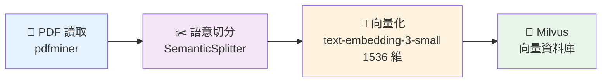

# RAG System - 檢索增強生成系統

基於 LlamaIndex、Milvus 和 OpenAI 的企業級 RAG（Retrieval-Augmented Generation）系統，提供文檔智能問答服務。

## 🚀 功能特性

- **文檔處理**：支援 PDF 文件解析和文字處理
- **向量化存儲**：使用 Milvus 向量資料庫進行高效檢索
- **智能問答**：結合 OpenAI GPT 模型生成準確回答
- **RESTful API**：提供完整的 Web API 服務
- **本地查詢**：支援命令列和交互式查詢模式
- **模組化設計**：數據處理和查詢服務完全分離
- **批次處理**：支援大量文檔的批次入庫和查詢

## 📊 文檔索引流程



| 步驟 | 說明 | 使用技術 |
|------|------|----------|
| 📄 讀取 | 提取 PDF 文字內容 | pdfminer |
| ✂️ 切分 | 智能語意切分，避免生硬斷句 | SemanticSplitterNodeParser |
| 🔢 向量化 | 文字轉 1536 維向量 | OpenAI text-embedding-3-small |
| 💾 存儲 | 向量索引建立與存儲 | Milvus VectorStore |

## 🔍 查詢問答流程


| 步驟 | 說明 | 使用技術 |
|------|------|----------|
| ❓ 提問 | 使用者輸入問題 | 命令列 / API |
| 🔢 向量化 | 將問題轉換為 1536 維向量 | OpenAI text-embedding-3-small |
| 🔍 檢索 | 在向量資料庫中找出最相關的 Top-K 文檔 | Milvus 語意搜尋 |
| 🎯 重排序 | 使用 Rerank 模型精準排序檢索結果 | MxbaiRerankV2 |
| 📝 組合 | 將問題和檢索結果套入 Prompt 模板 | Custom PromptTemplate |
| 🤖 生成 | LLM 根據上下文生成答案 | OpenAI GPT-4 |
| 💬 返回 | 返回答案和來源資訊 | JSON / 命令列輸出 |

## 📁 專案結構

```
rag_system/
├── shared_config.py          # 共享配置
├── document_indexing.py      # 文檔索引模組
├── query_service.py          # 查詢服務 API
├── local_query.py            # 本地查詢工具
├── main.py                   # 原始整合版本（可選）
├── docker-compose-milvus.yml # Milvus 容器配置
├── requirements.txt          # Python 依賴
├── .env.example             # 環境變數範例
└── README.md                # 本文件
```

## 🛠️ 環境需求

- Python 3.8+
- Docker 和 Docker Compose
- OpenAI API 金鑰

## 📦 安裝步驟

### 1. 克隆專案
```bash
git clone <your-repo-url>
cd rag_system
```

### 2. 安裝 Python 依賴
```bash
pip install -r requirements.txt
```

### 3. 設置環境變數
```bash
cp .env.example .env
# 編輯 .env 文件，填入你的 OpenAI API 金鑰
```

**.env 檔案內容：**
```env
OPENAI_API_KEY=your_openai_api_key_here
```

### 4. 啟動 Milvus 向量資料庫
```bash
docker-compose -f docker-compose-milvus.yml up -d
```

等待所有服務啟動完成（大約 30-60 秒）。

### 5. 驗證 Milvus 運行狀態
```bash
# 檢查容器狀態
docker-compose -f docker-compose-milvus.yml ps

# 檢查 Milvus 健康狀態
curl http://localhost:9091/healthz
```

## 🚀 使用指南

### 第一階段：文檔索引

#### 處理單個 PDF 文件
```bash
python document_indexing.py --pdf your_document.pdf
```

#### 批次處理目錄中的 PDF 文件
```bash
python document_indexing.py --directory ./documents --pattern "*.pdf"
```

#### 直接輸入文字資料
```bash
python document_indexing.py --text "這是第一段文字" "這是第二段文字"
```

#### 示例模式（測試用）
```bash
python document_indexing.py
```

#### 清空數據庫
```bash
python document_indexing.py --clear
```

### 第二階段：查詢服務

系統提供兩種查詢方式：

#### 方式一：RESTful API 服務

```bash
python query_service.py
```

服務啟動後：
- API 服務：http://localhost:8000
- API 文檔：http://localhost:8000/docs
- 健康檢查：http://localhost:8000/health

#### 方式二：本地查詢工具（推薦）

```bash
# 交互式模式（預設）
python local_query.py

# 單次查詢
python local_query.py -q "什麼是人工智慧？"

# 檢索相關文檔
python local_query.py -d "機器學習" -k 3

# 批次查詢
python local_query.py -b "什麼是AI？" "深度學習是什麼？" -o results.json
```

## 📡 API 使用

### 1. 問答查詢
```bash
curl -X POST "http://localhost:8000/query" \
     -H "Content-Type: application/json" \
     -d '{
       "question": "什麼是人工智慧？",
       "top_k": 5
     }'
```

### 2. 相關文檔檢索
```bash
curl -X POST "http://localhost:8000/relevant-docs" \
     -H "Content-Type: application/json" \
     -d '{
       "question": "機器學習的應用",
       "top_k": 3
     }'
```

### 3. 健康檢查
```bash
curl http://localhost:8000/health
```

### 4. 服務統計
```bash
curl http://localhost:8000/stats
```

## 💻 本地查詢工具詳細說明

### 交互式模式

```bash
python local_query.py -i
# 或直接執行
python local_query.py
```

進入交互式模式後，可使用以下命令：

- **直接輸入問題** - 獲得完整的問答回應
- **docs [問題]** - 僅檢索相關文檔，不生成回答
- **help** - 顯示命令說明
- **quit/exit/q** - 退出程序

### 命令列參數

```bash
# 單次查詢問題
python local_query.py -q "什麼是人工智慧？" -k 5

# 檢索相關文檔
python local_query.py -d "機器學習的應用" -k 3

# 批次查詢並保存結果
python local_query.py -b "AI是什麼？" "深度學習原理" -o output.json

# 不顯示來源信息
python local_query.py -q "什麼是NLP？" --no-sources
```

### 參數說明

- `-q, --question`：單次查詢問題
- `-d, --docs`：檢索相關文檔
- `-k, --top-k`：檢索文檔數量
- `-i, --interactive`：交互式模式
- `-b, --batch`：批次查詢問題列表
- `-o, --output`：輸出文件路徑
- `--no-sources`：不顯示來源信息

## 🐍 Python API 程式範例

### RESTful API 調用

```python
import requests

# API 基礎 URL
BASE_URL = "http://localhost:8000"

# 問答查詢
def ask_question(question, top_k=5):
    response = requests.post(
        f"{BASE_URL}/query",
        json={
            "question": question,
            "top_k": top_k
        }
    )
    return response.json()

# 使用範例
result = ask_question("什麼是深度學習？")
print(f"問題：{result['question']}")
print(f"回答：{result['answer']}")
print(f"處理時間：{result['processing_time']:.2f} 秒")
```

### 本地查詢系統調用

```python
from local_query import LocalQuerySystem

# 初始化查詢系統
query_system = LocalQuerySystem()

# 單次查詢
result = query_system.query("什麼是人工智慧？", top_k=3)
print(f"回答: {result['answer']}")

# 檢索相關文檔
docs = query_system.get_relevant_documents("機器學習", top_k=5)
for i, doc in enumerate(docs, 1):
    print(f"{i}. 分數: {doc['score']:.4f}")
    print(f"   內容: {doc['text'][:100]}...")

# 批次查詢
questions = ["什麼是AI？", "深度學習的原理？"]
results = query_system.batch_query(questions, "batch_results.json")
```

## ⚙️ 配置選項

在 `shared_config.py` 中可以調整以下設定：

```python
# OpenAI 配置
EMBEDDING_MODEL = "text-embedding-3-small"  # 嵌入模型
LLM_MODEL = "gpt-4"                         # 語言模型
LLM_TEMPERATURE = 0.1                       # 生成溫度

# Milvus 配置
MILVUS_HOST = "localhost"                   # Milvus 主機
MILVUS_PORT = 19530                        # Milvus 端口
MILVUS_COLLECTION_NAME = "rag_documents"   # 集合名稱

# 文檔處理配置
CHUNK_SIZE = 512                           # 分塊大小
CHUNK_OVERLAP = 50                         # 分塊重疊
SIMILARITY_TOP_K = 5                       # 預設檢索數量

# API 配置
API_HOST = "0.0.0.0"                      # API 監聽地址
API_PORT = 8000                           # API 端口
```

## 🔧 故障排除

### 常見問題

**1. OpenAI API 金鑰錯誤**
```
解決方案：檢查 .env 文件中的 OPENAI_API_KEY 是否正確設置
```

**2. Milvus 連接失敗**
```bash
# 檢查 Milvus 服務狀態
docker-compose -f docker-compose-milvus.yml ps
# 重啟 Milvus 服務
docker-compose -f docker-compose-milvus.yml restart
```

**3. PDF 解析失敗**
```
解決方案：確保 PDF 文件沒有密碼保護，且格式正確
```

**4. 記憶體不足**
```
解決方案：調整 CHUNK_SIZE 為更小的值，或分批處理文檔
```

### 日誌檢查

```bash
# 查看 Milvus 日誌
docker-compose -f docker-compose-milvus.yml logs standalone

# 查看 Python 應用日誌
python query_service.py  # 直接運行查看輸出
```

## 🔍 監控和維護

### Milvus Web UI
- 訪問：http://localhost:9001
- 用戶名：minioadmin
- 密碼：minioadmin

### 資料庫管理
```bash
# 停止服務
docker-compose -f docker-compose-milvus.yml down

# 清除資料（謹慎使用）
docker-compose -f docker-compose-milvus.yml down -v

# 重新啟動
docker-compose -f docker-compose-milvus.yml up -d
```

## 📈 性能優化

1. **調整 CHUNK_SIZE**：根據文檔特性調整分塊大小
2. **批次處理**：使用目錄批次模式處理大量文檔
3. **索引優化**：在 Milvus 中調整索引參數
4. **硬體配置**：為 Milvus 分配足夠的記憶體和 CPU

## 🤝 貢獻指南

1. Fork 本專案
2. 建立功能分支 (`git checkout -b feature/amazing-feature`)
3. 提交更改 (`git commit -m 'Add some amazing feature'`)
4. 推送到分支 (`git push origin feature/amazing-feature`)
5. 開啟 Pull Request

## 📄 授權條款

本專案採用 MIT 授權條款 - 查看 [LICENSE](LICENSE) 文件了解詳情。

## 📞 聯絡資訊

如有問題或建議，請：
- 開啟 GitHub Issue
- 發送電子郵件至：your-email@example.com

## 🙏 致謝

- [LlamaIndex](https://www.llamaindex.ai/) - 提供強大的 RAG 框架
- [Milvus](https://milvus.io/) - 高性能向量資料庫
- [OpenAI](https://openai.com/) - 先進的語言模型服務
- [FastAPI](https://fastapi.tiangolo.com/) - 現代化的 Web 框架